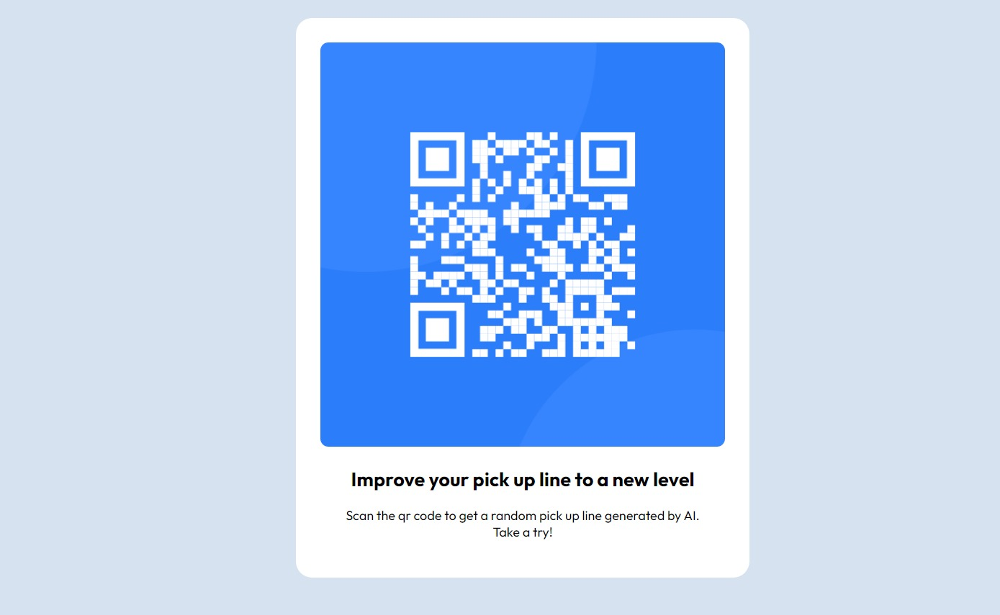

# Frontend Mentor - QR code component solution

This is a solution to the [QR code component challenge on Frontend Mentor](https://www.frontendmentor.io/challenges/qr-code-component-iux_sIO_H). Frontend Mentor challenges help you improve your coding skills by building realistic projects. 

## Table of contents

- [Overview](#overview)
  - [Screenshot](#screenshot)
  - [Links](#links)
- [My process](#my-process)
  - [Built with](#built-with)
  - [Continued development](#continued-development)
- [Author](#author)

## Overview

### Screenshot

### Links

- Solution URL: [qr-code component](https://your-solution-url.com)

## My process

### Built with

- HTML5
- CSS
- Mobile-first workflow

### Continued development

You can connect this component to some api that serve pick up line and send to your crush or any body you love. 

## Author

- Website - [Eudes brg](https://www.your-site.com)
- Frontend Mentor - [@Eudesbrg](https://www.frontendmentor.io/profile/Eudesbrg)

